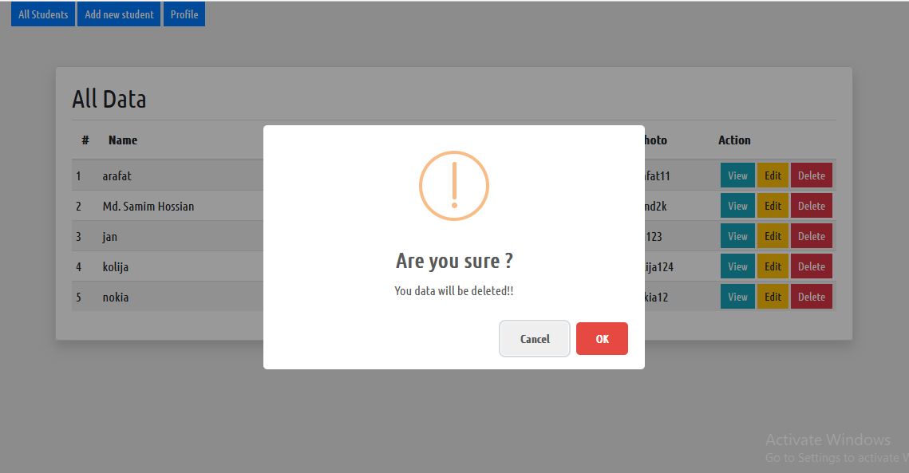

## Ajax crudvs with simple page application

<ul>
    <li> We have create a ajax crudvs with no loading system <li>
    <li> We have use sweetalert <li>
        
        
        
        
        
        swal({
				title: 'Are you sure ?',
				text: 'You data will be deleted!!',
				icon: 'warning',
				buttons: true,
				dangerMode: true,
			}).then((conf) => {
						if( conf == true){
							$.ajax({
						url: 'ajax_tem/delete.php',
						method: "POST",
						data:{
							id : id
						},
						success: function(data){
							swal({
								title: 'Done',
								text: 'You data has been deleted successfully!',
								icon: 'success',

							});
							allData();

						}

					});
				}else{
					swal({
						title: 'Safe',
						text: 'Your data is safe now',
						icon: 'success'
					});
				}
    <li> More coming soon<li>
    <li> More coming soon <li>
    <li> More coming soon <li>
    <li> More coming soon <li>
    <li> More coming soon <li>
    <li> More coming soon <li>

</ul>